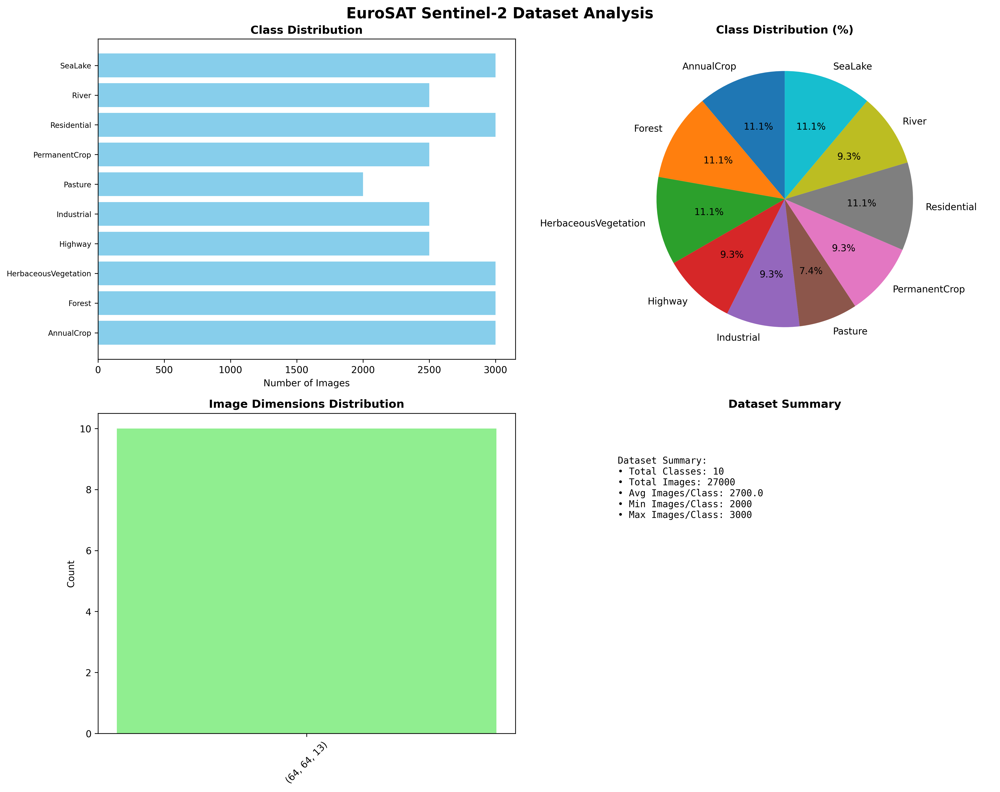
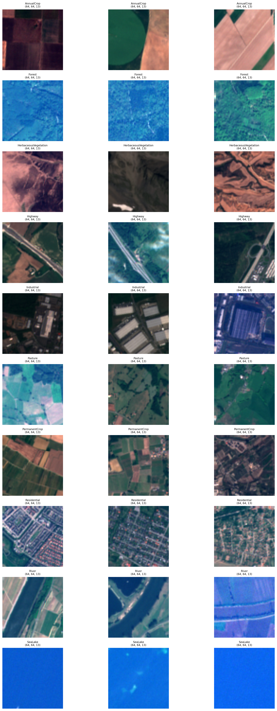
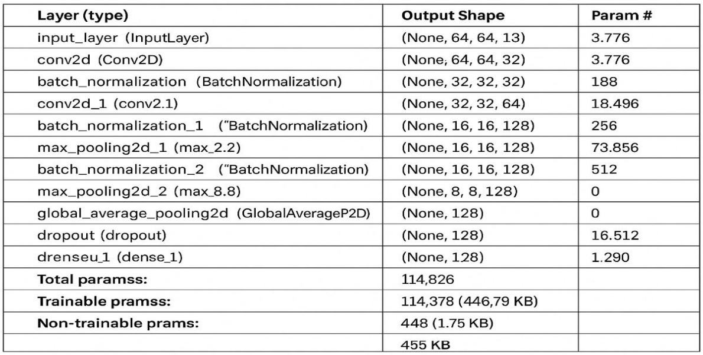
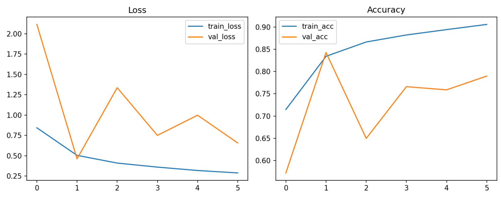

# Remote Sensing Land Cover Classification using CNN

This project implements a custom Convolutional Neural Network (CNN) trained from scratch to classify land cover types using 13-band multispectral satellite imagery from the EuroSAT Sentinel-2 dataset. The model is designed to handle non-RGB remote sensing data and achieves strong generalization performance across diverse land-cover classes.

## Dataset

- Dataset: EuroSAT Sentinel-2 (13-band multispectral)
- Total Classes: 10
- Total Images: ~27,000
- Image Size: 64 × 64
- Channels: 13 spectral bands

Classes:
AnnualCrop, Forest, HerbaceousVegetation, Highway, Industrial, Pasture, PermanentCrop, Residential, River, SeaLake

## Sample Multispectral Satellite Images

Below are sample images from the EuroSAT Sentinel-2 dataset representing different land cover classes. Each image contains 13 spectral bands and is resized to 64×64 resolution.

## Model Architecture

Custom CNN Architecture:

- Conv2D (32) + BatchNorm + MaxPooling
- Conv2D (64) + BatchNorm + MaxPooling
- Conv2D (128) + BatchNorm + MaxPooling
- Global Average Pooling
- Dense (128) + Dropout
- Output Dense (10) with Softmax

Total Parameters: ~114k

## Training Details

- Framework: TensorFlow / Keras
- Optimizer: Adam
- Batch Size: 16
- Epochs: 15
- Learning Rate: 0.001
- Early Stopping: Enabled
- Data Augmentation:
  - Horizontal Flip
  - Vertical Flip
  - Rotation

## Results

- Validation Accuracy: ~84%
- Test Accuracy: ~83%
- Macro F1 Score: ~0.83

Strong performance on:
- SeaLake (99%)
- Industrial (95%)
- River (92%)

## Training Performance

The model demonstrates stable learning behavior with consistent reduction in training loss and improvement in validation accuracy.

## Applications

- Land Use Mapping
- Agricultural Monitoring
- Environmental Assessment
- Urban Planning

## How To Run

1. Clone repository:

https://github.com/srstm/Remote-Sensing-LandCover-Classification

2. Install dependencies:

pip install -r requirements.txt

3. Run notebook:

Open `remote_sensing.ipynb`

## Author

Trinay Mitra  
Computer Science Undergraduate  
Machine Learning & Computer Vision Enthusiast

